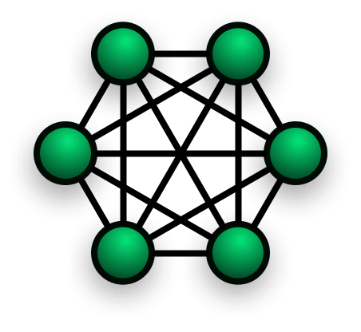
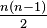

<p align="center">
<a href="https://codefund.io/properties/560/visit-sponsor">

</a>
</p>

# simple-peer [![travis][travis-image]][travis-url] [![npm][npm-image]][npm-url] [![downloads][downloads-image]][downloads-url] [![javascript style guide][standard-image]][standard-url] [![javascript style guide][sauce-image]][sauce-url]

[travis-image]: https://img.shields.io/travis/feross/simple-peer/master.svg
[travis-url]: https://travis-ci.org/feross/simple-peer
[npm-image]: https://img.shields.io/npm/v/simple-peer.svg
[npm-url]: https://npmjs.org/package/simple-peer
[downloads-image]: https://img.shields.io/npm/dm/simple-peer.svg
[downloads-url]: https://npmjs.org/package/simple-peer
[standard-image]: https://img.shields.io/badge/code_style-standard-brightgreen.svg
[standard-url]: https://standardjs.com
[sauce-image]: https://saucelabs.com/buildstatus/simple-peer
[sauce-url]: https://saucelabs.com/u/simple-peer

#### Simple WebRTC video/voice and data channels.

## features

- concise, **node.js style** API for [WebRTC](https://en.wikipedia.org/wiki/WebRTC)
- **works in node and the browser!**
- supports **video/voice streams**
- supports **data channel**
  - text and binary data
  - node.js [duplex stream](http://nodejs.org/api/stream.html) interface
- supports advanced options like:
  - enable/disable [trickle ICE candidates](http://webrtchacks.com/trickle-ice/)
  - manually set config options
  - transceivers and renegotiation

## install

```
npm install simple-peer
```

This package works in the browser with [browserify](https://browserify.org). If
you do not use a bundler, you can use the `simplepeer.min.js` standalone script
directly in a `<script>` tag. This exports a `SimplePeer` constructor on
`window`. Wherever you see `Peer` in the examples below, substitute that with
`SimplePeer`.

## usage

Let's create an html page that lets you manually connect two peers:

```html
<html>
  <body>
    <style>
      #outgoing {
        width: 600px;
        word-wrap: break-word;
        white-space: normal;
      }
    </style>
    <form>
      <textarea id="incoming"></textarea>
      <button type="submit">submit</button>
    </form>
    <pre id="outgoing"></pre>
    <script src="simplepeer.min.js"></script>
    <script>
      const p = new SimplePeer({
        initiator: location.hash === '#1',
        trickle: false
      })

      p.on('error', err => console.log('error', err))

      p.on('signal', data => {
        console.log('SIGNAL', JSON.stringify(data))
        document.querySelector('#outgoing').textContent = JSON.stringify(data)
      })

      document.querySelector('form').addEventListener('submit', ev => {
        ev.preventDefault()
        p.signal(JSON.parse(document.querySelector('#incoming').value))
      })

      p.on('connect', () => {
        console.log('CONNECT')
        p.send('whatever' + Math.random())
      })

      p.on('data', data => {
        console.log('data: ' + data)
      })
    </script>
  </body>
</html>
```

Visit `index.html#1` from one browser (the initiator) and `index.html` from another
browser (the receiver).

An "offer" will be generated by the initiator. Paste this into the receiver's form and
hit submit. The receiver generates an "answer". Paste this into the initiator's form and
hit submit.

Now you have a direct P2P connection between two browsers!

### A simpler example

This example create two peers **in the same web page**.

In a real-world application, *you would never do this*. The sender and receiver `Peer`
instances would exist in separate browsers. A "signaling server" (usually implemented with
websockets) would be used to exchange signaling data between the two browsers until a
peer-to-peer connection is established.

### data channels

```js
var Peer = require('simple-peer')

var peer1 = new Peer({ initiator: true })
var peer2 = new Peer()

peer1.on('signal', data => {
  // when peer1 has signaling data, give it to peer2 somehow
  peer2.signal(data)
})

peer2.on('signal', data => {
  // when peer2 has signaling data, give it to peer1 somehow
  peer1.signal(data)
})

peer1.on('connect', () => {
  // wait for 'connect' event before using the data channel
  peer1.send('hey peer2, how is it going?')
})

peer2.on('data', data => {
  // got a data channel message
  console.log('got a message from peer1: ' + data)
})
```

### video/voice

Video/voice is also super simple! In this example, peer1 sends video to peer2.

```js
var Peer = require('simple-peer')

// get video/voice stream
navigator.getUserMedia({ video: true, audio: true }, gotMedia, () => {})

function gotMedia (stream) {
  var peer1 = new Peer({ initiator: true, stream: stream })
  var peer2 = new Peer()

  peer1.on('signal', data => {
    peer2.signal(data)
  })

  peer2.on('signal', data => {
    peer1.signal(data)
  })

  peer2.on('stream', stream => {
    // got remote video stream, now let's show it in a video tag
    var video = document.querySelector('video')

    if ('srcObject' in video) {
      video.srcObject = stream
    } else {
      video.src = window.URL.createObjectURL(stream) // for older browsers
    }

    video.play()
  })
}
```

For two-way video, simply pass a `stream` option into both `Peer` constructors. Simple!

### dynamic video/voice

It is also possible to establish a data-only connection at first, and later add
a video/voice stream, if desired.

```js
var Peer = require('simple-peer') // create peer without waiting for media

var peer1 = new Peer({ initiator: true }) // you don't need streams here
var peer2 = new Peer()

peer1.on('signal', data => {
  peer2.signal(data)
})

peer2.on('signal', data => {
  peer1.signal(data)
})

peer2.on('stream', stream => {
  // got remote video stream, now let's show it in a video tag
  var video = document.querySelector('video')

  if ('srcObject' in video) {
    video.srcObject = stream
  } else {
    video.src = window.URL.createObjectURL(stream) // for older browsers
  }

  video.play()
})

function addMedia (stream) {
  peer1.addStream(stream) // <- add streams to peer dynamically
}

// then, anytime later...
navigator.getUserMedia({ video: true, audio: true }, addMedia, () => {})
```

### in node

To use this library in node, pass in `opts.wrtc` as a parameter:

```js
var Peer = require('simple-peer')
var wrtc = require('wrtc')

var peer1 = new Peer({ initiator: true, wrtc: wrtc })
var peer2 = new Peer({ wrtc: wrtc })
```

## Who is using `simple-peer`?

- [WebTorrent](http://webtorrent.io) - Streaming torrent client in the browser
- [Instant.io](https://instant.io) - Secure, anonymous, streaming file transfer
- [Zencastr](https://zencastr.com) - Easily record your remote podcast interviews in studio quality.
- [Friends](https://github.com/moose-team/friends) - Peer-to-peer chat powered by the web
- [Socket.io-p2p](https://github.com/socketio/socket.io-p2p) - Official Socket.io P2P communication library
- [ScreenCat](https://maxogden.github.io/screencat/) - Screen sharing + remote collaboration app
- [WebCat](https://www.npmjs.com/package/webcat) - P2P pipe across the web using Github private/public key for auth
- [RTCCat](https://www.npmjs.com/package/rtcat) - WebRTC netcat
- [PeerNet](https://www.npmjs.com/package/peernet) - Peer-to-peer gossip network using randomized algorithms
- [PusherTC](http://pushertc.herokuapp.com) - Video chat with using Pusher. See [guide](http://blog.carbonfive.com/2014/10/16/webrtc-made-simple/).
- [lxjs-chat](https://github.com/feross/lxjs-chat) - Omegle-like video chat site
- [Whiteboard](https://github.com/feross/whiteboard) - P2P Whiteboard powered by WebRTC and WebTorrent
- [Peer Calls](https://peercalls.com) - WebRTC group video calling. Create a room. Share the link.
- [Netsix](https://mmorainville.github.io/netsix-gh-pages/) - Send videos to your friends using WebRTC so that they can watch them right away.
- [Stealthy](https://www.stealthy.im) - Stealthy is a decentralized, end-to-end encrypted, p2p chat application.
- [oorja.io](https://github.com/akshayKMR/oorja) - Effortless video-voice chat with realtime collaborative features. Extensible using react components 🙌
- [TalktoMe](https://talktome.space) - Skype alternative for audio/video conferencing based on WebRTC, but without the loss of packets.
- [CDNBye](https://github.com/cdnbye/hlsjs-p2p-engine) - CDNBye implements WebRTC datachannel to scale live/vod video streaming by peer-to-peer network using bittorrent-like protocol
- [Detox](https://github.com/Detox) - Overlay network for distributed anonymous P2P communications entirely in the browser
- [Metastream](https://github.com/samuelmaddock/metastream) - Watch streaming media with friends.
- [firepeer](https://github.com/natzcam/firepeer) - secure signalling and authentication using firebase realtime database
- [Genet](https://github.com/elavoie/webrtc-tree-overlay) - Fat-tree overlay to scale the number of concurrent WebRTC connections to a single source ([paper](https://arxiv.org/abs/1904.11402)).
- [WebRTC Connection Testing](https://github.com/elavoie/webrtc-connection-testing) - Quickly test direct connectivity between all pairs of participants ([demo](https://webrtc-connection-testing.herokuapp.com/)).
- [Firstdate.co](https://firstdate.co) - Online video dating for actually meeting people and not just messaging them
- [TensorChat](https://github.com/EhsaanIqbal/tensorchat) - It's simple - Create. Share. Chat.
- *Your app here! - send a PR!*

## api

### `peer = new Peer([opts])`

Create a new WebRTC peer connection.

A "data channel" for text/binary communication is always established, because it's cheap and often useful. For video/voice communication, pass the `stream` option.

If `opts` is specified, then the default options (shown below) will be overridden.

```
{
  initiator: false,
  channelConfig: {},
  channelName: '<random string>',
  config: { iceServers: [{ urls: 'stun:stun.l.google.com:19302' }, { urls: 'stun:global.stun.twilio.com:3478?transport=udp' }] },
  offerOptions: {},
  answerOptions: {},
  sdpTransform: function (sdp) { return sdp },
  stream: false,
  streams: [],
  trickle: true,
  allowHalfTrickle: false,
  wrtc: {}, // RTCPeerConnection/RTCSessionDescription/RTCIceCandidate
  objectMode: false
}
```

The options do the following:

- `initiator` - set to `true` if this is the initiating peer
- `channelConfig` - custom webrtc data channel configuration (used by `createDataChannel`)
- `channelName` - custom webrtc data channel name
- `config` - custom webrtc configuration (used by `RTCPeerConnection` constructor)
- `offerOptions` - custom offer options (used by `createOffer` method)
- `answerOptions` - custom answer options (used by `createAnswer` method)
- `sdpTransform` - function to transform the generated SDP signaling data (for advanced users)
- `stream` - if video/voice is desired, pass stream returned from `getUserMedia`
- `streams` - an array of MediaStreams returned from `getUserMedia`
- `trickle` - set to `false` to disable [trickle ICE](http://webrtchacks.com/trickle-ice/) and get a single 'signal' event (slower)
- `wrtc` - custom webrtc implementation, mainly useful in node to specify in the [wrtc](https://npmjs.com/package/wrtc) package
- `objectMode` - set to `true` to create the stream in [Object Mode](https://nodejs.org/api/stream.html#stream_object_mode). In this mode, incoming string data is not automatically converted to `Buffer` objects.

### `peer.signal(data)`

Call this method whenever the remote peer emits a `peer.on('signal')` event.

The `data` will encapsulate a webrtc offer, answer, or ice candidate. These messages help
the peers to eventually establish a direct connection to each other. The contents of these
strings are an implementation detail that can be ignored by the user of this module;
simply pass the data from 'signal' events to the remote peer and call `peer.signal(data)`
to get connected.

### `peer.send(data)`

Send text/binary data to the remote peer. `data` can be any of several types: `String`,
`Buffer` (see [buffer](https://github.com/feross/buffer)), `ArrayBufferView` (`Uint8Array`,
etc.), `ArrayBuffer`, or `Blob` (in browsers that support it).

Note: If this method is called before the `peer.on('connect')` event has fired, then data
will be buffered.

### `peer.addStream(stream)`

Add a `MediaStream` to the connection.

### `peer.removeStream(stream)`

Remove a `MediaStream` from the connection.

### `peer.addTrack(track, stream)`

Add a `MediaStreamTrack` to the connection. Must also pass the `MediaStream` you want to attach it to.

### `peer.removeTrack(track, stream)`

Remove a `MediaStreamTrack` from the connection. Must also pass the `MediaStream` that it was attached to.

### `peer.addTransceiver(kind, init)`

Add a `RTCRtpTransceiver` to the connection. Can be used to add transceivers before adding tracks. Automatically called as neccesary by `addTrack`.

### `peer.destroy([err])`

Destroy and cleanup this peer connection.

If the optional `err` parameter is passed, then it will be emitted as an `'error'`
event on the stream.

### `Peer.WEBRTC_SUPPORT`

Detect native WebRTC support in the javascript environment.

```js
var Peer = require('simple-peer')

if (Peer.WEBRTC_SUPPORT) {
  // webrtc support!
} else {
  // fallback
}
```

### duplex stream

`Peer` objects are instances of `stream.Duplex`. They behave very similarly to a
`net.Socket` from the node core `net` module. The duplex stream reads/writes to the data
channel.

```js
var peer = new Peer(opts)
// ... signaling ...
peer.write(new Buffer('hey'))
peer.on('data', function (chunk) {
  console.log('got a chunk', chunk)
})
```

## events


### `peer.on('signal', data => {})`

Fired when the peer wants to send signaling data to the remote peer.

**It is the responsibility of the application developer (that's you!) to get this data to
the other peer.** This usually entails using a websocket signaling server. This data is an
`Object`, so  remember to call `JSON.stringify(data)` to serialize it first. Then, simply
call `peer.signal(data)` on the remote peer.

(Be sure to listen to this event immediately to avoid missing it. For `initiator: true`
peers, it fires right away. For `initatior: false` peers, it fires when the remote
offer is received.)

### `peer.on('connect', () => {})`

Fired when the peer connection and data channel are ready to use.

### `peer.on('data', data => {})`

Received a message from the remote peer (via the data channel).

`data` will be either a `String` or a `Buffer/Uint8Array` (see [buffer](https://github.com/feross/buffer)).

### `peer.on('stream', stream => {})`

Received a remote video stream, which can be displayed in a video tag:

```js
peer.on('stream', stream => {
  var video = document.querySelector('video')
  if ('srcObject' in video) {
    video.srcObject = stream
  } else {
    video.src = window.URL.createObjectURL(stream)
  }
  video.play()
})
```

### `peer.on('track', (track, stream) => {})`

Received a remote audio/video track. Streams may contain multiple tracks.

### `peer.on('close', () => {})`

Called when the peer connection has closed.

### `peer.on('error', (err) => {})`

Fired when a fatal error occurs. Usually, this means bad signaling data was received from the remote peer.

`err` is an `Error` object.

## error codes

Errors returned by the `error` event have an `err.code` property that will indicate the origin of the failure.

Possible error codes:
- `ERR_WEBRTC_SUPPORT`
- `ERR_CREATE_OFFER`
- `ERR_CREATE_ANSWER`
- `ERR_SET_LOCAL_DESCRIPTION`
- `ERR_SET_REMOTE_DESCRIPTION`
- `ERR_ADD_ICE_CANDIDATE`
- `ERR_ICE_CONNECTION_FAILURE`
- `ERR_SIGNALING`
- `ERR_DATA_CHANNEL`


## connecting more than 2 peers?

The simplest way to do that is to create a full-mesh topology. That means that every peer
opens a connection to every other peer. To illustrate:



To broadcast a message, just iterate over all the peers and call `peer.send`.

So, say you have 3 peers. Then, when a peer wants to send some data it must send it 2
times, once to each of the other peers. So you're going to want to be a bit careful about
the size of the data you send.

Full mesh topologies don't scale well when the number of peers is very large. The total
number of edges in the network will be 
where `n` is the number of peers.

For clarity, here is the code to connect 3 peers together:

#### Peer 1

```js
// These are peer1's connections to peer2 and peer3
var peer2 = new Peer({ initiator: true })
var peer3 = new Peer({ initiator: true })

peer2.on('signal', data => {
  // send this signaling data to peer2 somehow
})

peer2.on('connect', () => {
  peer2.send('hi peer2, this is peer1')
})

peer2.on('data', data => {
  console.log('got a message from peer2: ' + data)
})

peer3.on('signal', data => {
  // send this signaling data to peer3 somehow
})

peer3.on('connect', () => {
  peer3.send('hi peer3, this is peer1')
})

peer3.on('data', data => {
  console.log('got a message from peer3: ' + data)
})
```

#### Peer 2

```js
// These are peer2's connections to peer1 and peer3
var peer1 = new Peer()
var peer3 = new Peer({ initiator: true })

peer1.on('signal', data => {
  // send this signaling data to peer1 somehow
})

peer1.on('connect', () => {
  peer1.send('hi peer1, this is peer2')
})

peer1.on('data', data => {
  console.log('got a message from peer1: ' + data)
})

peer3.on('signal', data => {
  // send this signaling data to peer3 somehow
})

peer3.on('connect', () => {
  peer3.send('hi peer3, this is peer2')
})

peer3.on('data', data => {
  console.log('got a message from peer3: ' + data)
})
```

#### Peer 3

```js
// These are peer3's connections to peer1 and peer2
var peer1 = new Peer()
var peer2 = new Peer()

peer1.on('signal', data => {
  // send this signaling data to peer1 somehow
})

peer1.on('connect', () => {
  peer1.send('hi peer1, this is peer3')
})

peer1.on('data', data => {
  console.log('got a message from peer1: ' + data)
})

peer2.on('signal', data => {
  // send this signaling data to peer2 somehow
})

peer2.on('connect', () => {
  peer2.send('hi peer2, this is peer3')
})

peer2.on('data', data => {
  console.log('got a message from peer2: ' + data)
})
```

## memory usage

If you call `peer.send(buf)`, `simple-peer` is not keeping a reference to `buf`
and sending the buffer at some later point in time. We immediately call
`channel.send()` on the data channel. So it should be fine to mutate the buffer
right afterward.

However, beware that `peer.write(buf)` (a writable stream method) does not have
the same contract. It will potentially buffer the data and call
`channel.send()` at a future point in time, so definitely don't assume it's
safe to mutate the buffer.


## connection does not work on some networks?

If a direct connection fails, in particular, because of NAT traversal and/or firewalls,
WebRTC ICE uses an intermediary (relay) TURN server. In other words, ICE will first use
STUN with UDP to directly connect peers and, if that fails, will fall back to a TURN relay
server.

In order to use a TURN server, you must specify the `config` option to the `Peer`
constructor. See the API docs above.

[](https://github.com/feross/standard)

## license

MIT. Copyright (c) [Feross Aboukhadijeh](http://feross.org).
